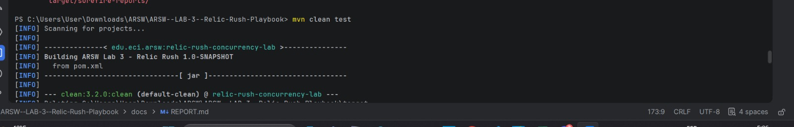
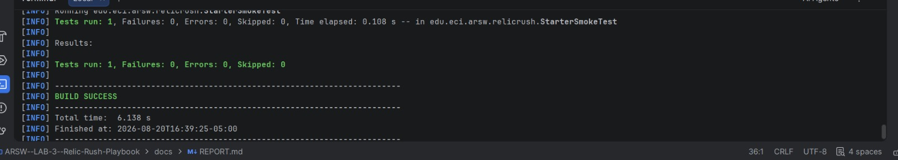
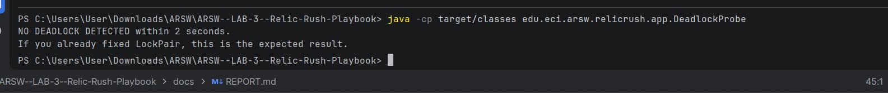
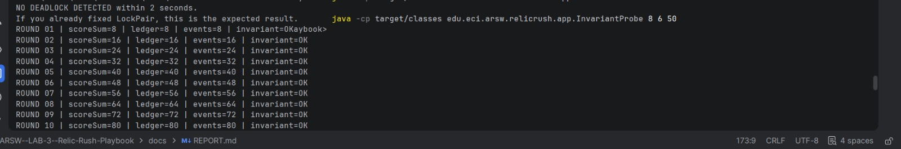
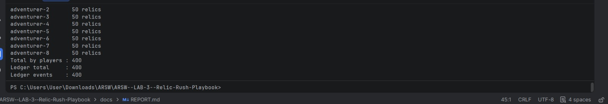
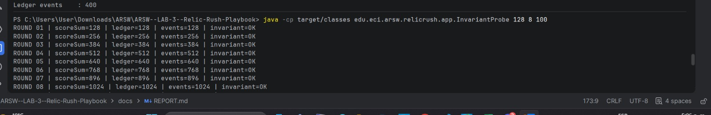
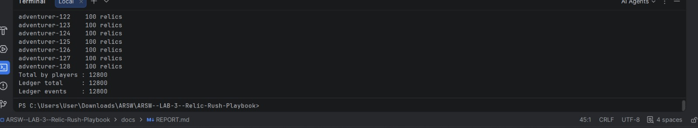
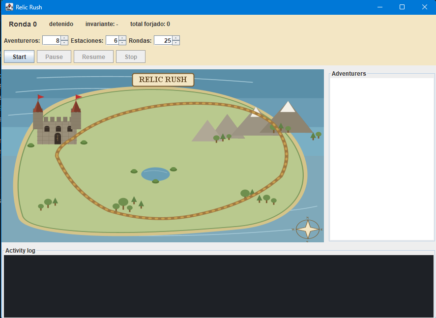
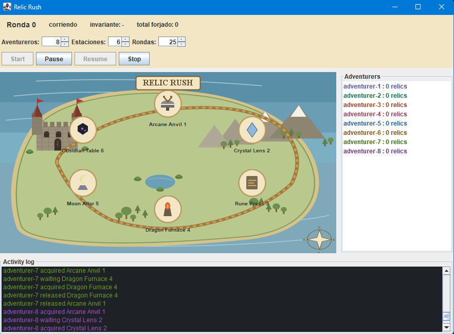
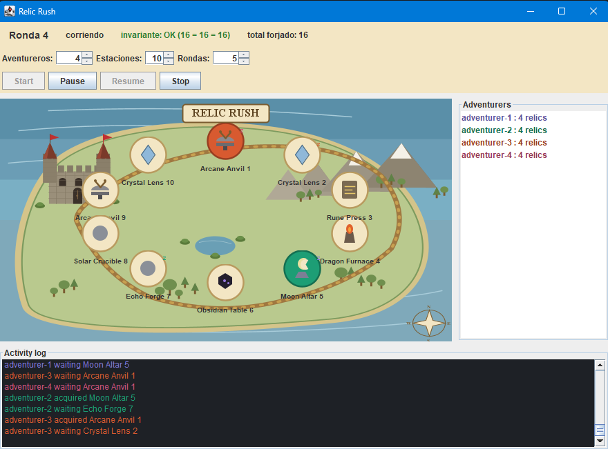

# ARSW Lab 3 - Relic Rush - Delivery Report

## Team

| Student                     | ID         | GitHub   |
|-----------------------------|------------|----------|
| Mabel Fernanda Bernal Amaya | 1000100629 | MabelBernalAmaya |
| Nicolas David Prieto Ramos  | 1000091873 | NicolasPrieto12  |
| Juan Eduardo Vera Acero     | 1000091871 | JUNE2908 |

Repository: `https://github.com/ARSW-LABORATORIOS/ARSW--LAB-3--Relic-Rush-Playbook.git`

Final commit: `SHA`

## 1. Baseline observations

- Command(s) executed:
- `java -cp target/classes edu.eci.arsw.relicrush.app.LedgerRaceProbe 64 5000`
- `java -cp target/classes edu.eci.arsw.relicrush.app.DeadlockProbe`

- What happened?
the LedgerRaceProbe showed different values between the expected
number of crafted relics, totalCrafted and eventCount. on the other
hand DeadlockProbe detected a deadlock between two threads 
that are trying to acquire the same forge stations in a different order

- Was the round invariant always preserved?
no, the invariant was broken bc of the values expected, also
totalCrafted and EventCount were different.

- Did the game stop unexpectedly?
the DeadlockProbe detected that two threads were blocked 
while waiting for resources owned by each other

Evidence:

```text
PS C:\Users\User\Downloads\ARSW\ARSW--LAB-3--Relic-Rush-Playbook> java -cp target/classes edu.eci.arsw.relicrush.app.LedgerRaceProbe 64 5000                                                                  
expected=320000 totalCrafted=8217 eventCount=251457 invariant=BROKEN
PS C:\Users\User\Downloads\ARSW\ARSW--LAB-3--Relic-Rush-Playbook> java -cp target/classes edu.eci.arsw.relicrush.app.LedgerRaceProbe 64 5000                                                                  
expected=320000 totalCrafted=5638 eventCount=246315 invariant=BROKEN
```

## 2. Coordination analysis

Explain the responsibility of both barriers:

- `roundStart`: this works as a synchronization at the beginning
of each round, each adventurer needs to wait until the coordinator 
is ready, this in order to not let players start the round 
before the others

- `roundEnd`: this work as a point of synchronization where 
the coordinator waits until the end of the turn of all the 
adventurer to read the scores and the ledger, in order to
not read an incomplete state while other threads are still 
working

Why is `Thread.sleep(...)` not a valid replacement for a barrier?
R/ is not a valid replacement bc it only stops the threads for 
an exact amount of time, this doesn´t guarantee that in this time
all the other threads will have finished their work. On the other
hand reading the snapshot after the barrier guarantees that all the 
changes made by the adventurer threads before reaching the barrier
are visible by the coordinator

## 3. Thread-safety problems

| Shared state  | Problem                                                                                            | Invariant at risk                                                  | Solution                                 | Why this solution?                                                       |
|---------------|----------------------------------------------------------------------------------------------------|--------------------------------------------------------------------|------------------------------------------|--------------------------------------------------------------------------|
| `totalCrafted` | The update is a non-atomic read-modify-write operation, so concurrent threads can lose increments. | `sum of player scores == totalCrafted == number of events`         | `AtomicInteger.incrementAndGet()` | It makes the read-modify-write a single atomic operation without needing a lock, so no increment is ever lost. |
| `events`      | `ArrayList` is not thread-safe for concurrent writes.                                              | Every crafted relic must be registered exactly once in the ledger. | `CopyOnWriteArrayList`        | It guarantees safe concurrent appends. Writes are infrequent (one per craft) and reads in `snapshot()` are completely lock-free, which fits the access pattern of this ledger.   |

## 4. Deadlock diagnosis

### 4.1 Evidence

```text
PS C:\Users\User\Downloads\ARSW\ARSW--LAB-3--Relic-Rush-Playbook> java -cp target/classes edu.eci.arsw.relicrush.app.DeadlockProbe                                                                            
DEADLOCK DETECTED
- probe-A-anvil-then-furnace waiting on edu.eci.arsw.relicrush.model.ForgeStation@79fc0f2f owned by probe-B-furnace-then-anvil
- probe-B-furnace-then-anvil waiting on edu.eci.arsw.relicrush.model.ForgeStation@17a7cec2 owned by probe-A-anvil-then-furnace

```

### 4.2 Coffman conditions in Relic Rush

- Mutual exclusion:
Each forge station can only be used by one thread at a time because
the stations are protected using synchronized locks.

- Hold and wait:
An adventurer can hold the lock of the first forge station while
waiting to acquire the second one.

- No preemption: 
A lock cannot be taken away from a thread. The thread has to release
the forge station by itself after finishing the synchronized block.

- Circular wait:
Before the fix, two adventurers could request the same two stations
in a different order. This could make thread A wait for a station owned
by thread B while thread B waits for a station owned by thread A.

### 4.3 Wait-for graph

Describe or add a diagram.

`Thread A -> Furnace -> Thread B -> Anvil -> Thread A`

Thread A owns the Anvil and waits for the Furnace, while Thread B
owns the Furnace and waits for the Anvil. This creates a circular wait

### 4.4 Fix

What condition did you break?

The condition that was broken was circular wait. The solution defines
a deterministic order for the forge stations and all threads acquire
the two locks following that same order.

How did you preserve concurrency between independent forge operations?

Concurrency is still preserved because there is no global lock for the
whole game. Players that need different forge stations can still craft
at the same time.

## 5. Verification

| Players | Stations | Rounds | Deadlock? | Invariant result |
|--------:|---------:|-------:|-----------|------------------|
|       8 |        6 |     50 | No        | OK               |
|      32 |        8 |    100 | No        | OK               |
|     128 |        8 |    100 | No        | OK               |

evidence: 

InvariantProbe 8 6 50:
Total by players : 400
Ledger total     : 400
Ledger events    : 400

InvariantProbe 32 8 100:
Total by players : 3200
Ledger total     : 3200
Ledger events    : 3200

InvariantProbe 128 8 100:
Total by players : 12800
Ledger total     : 12800
Ledger events    : 12800

### Execution evidence

Maven tests:

command:

result:


Deadlock verification after the fix:



Invariant verification with 8 players:

command:


result:



Stress verification with 128 players:

command:


result:



## 6. Architectural trade-offs

Discuss:

- Correctness / reliability:
The final solution improves correctness because the shared ledger is now
protected against concurrent updates and the deadlock problem was prevented.
The main invariant of the game was preserved in all the verification that we 
had to make in the test like the sum of player scores, the ledger total and 
the number of events were always equal.

- Performance / throughput:
The solution still allows different players to craft at the same time when 
they are using different forge stations. This is better than using one global
lock because the whole game doesn´t need to wait for only one player to
finish.

- Contention:
for the contention can appear when many players try to use the same forge 
stations at the same time. In that case, some threads need to wait until the 
stations are released. When the number of players increases and the number of 
stations stays the same, this contention can become higher.

- Maintainability:
The lock ordering rule makes the behavior easier to understand because all
threads acquire the forge stations using the same deterministic order. This
reduces the possibility of introducing another deadlock if the rule is
maintained in future changes.


- Scalability:
When the number of players grows while the number of forge stations stays
constant, more threads compete for the same resources. The program will
work correctly, but the waiting time and contention can increase. for 
example even with 128 players and only 8 stations, the verification finished 
successfully and the invariant remained OK.

## 7. Mini ADR

### Context

Relic Rush requires every adventurer to acquire two forge stations before
crafting a relic. In the initial implementation, the locks were acquired in
the order requested by each player. This allowed two threads to acquire the
same stations in opposite orders and generate a deadlock.

### Decision

We decided to define a deterministic order for the forge stations. Every
thread must acquire the two station locks following the same order before
executing the craft operation. This prevents the circular wait condition.

### Alternatives considered

One alternative was to use one global lock for all craft operations. This
would prevent deadlocks, but it would also reduce concurrency because only
one player could craft at a time.

Another alternative was using timeouts or retries when acquiring locks, but
this would make the solution more complex and would not eliminate the root
cause of the deadlock.

### Consequences

The solution prevents circular wait while keeping concurrency between players
that use different forge stations. However, threads may still need to wait
when they compete for the same stations.

### Evidence

Before the fix, `DeadlockProbe` detected a deadlock between two threads
acquiring the Anvil and Furnace in opposite orders.

After applying the deterministic lock ordering, `DeadlockProbe` reported:

`NO DEADLOCK DETECTED within 2 seconds.`

The stress tests with 8, 32 and 128 players also finished with
`invariant=OK`.

## 8. Conclusions

1. with this lab we understood that concurrency problems are not only
related to performance but also to correctness and coordination between
the threads

2. we learned that shared state must be protected correctly to avoid race 
conditions, and that deadlocks can be prevented by using a deterministic 
order when acquiring multiple locks

3. The final stress tests showed that the solution preserves the game 
invariant even with a high number of players, while still allowing concurrent 
execution between independent forge operations.

## 9. Graphical interface

To run the graphical interface, build the project first if you haven't:

```bash
mvn -q -DskipTests package
```

Then run:

```bash
java -cp target/classes edu.eci.arsw.relicrush.app.RelicRushUIMain
```

#### Initial screen when the interface opens



#### 8 adventurers, 6 stations, 25 rounds



#### 4 adventurers, 10 stations, 5 rounds


